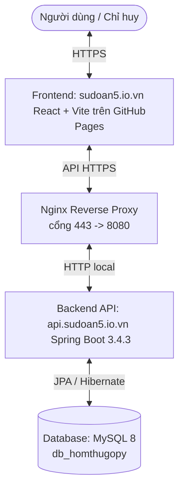

# Kiến trúc Hệ thống (System Architecture)

> Tự động tạo bởi Antigravity thông qua quy trình `/map` vào ngày 20/05/2026

## 1. Tổng quan Hệ thống (System Overview)

Dự án là phần **Backend** (mã nguồn Java Spring Boot) của hệ thống **Hòm thư góp ý số — Sư đoàn 5, Quân khu 7**. Nó hoạt động kết hợp với dự án **Frontend** (React + Vite) chạy trên máy client (trình duyệt của người dùng) nhằm cung cấp một kênh gửi góp ý trực tuyến ẩn danh cho quân nhân/thân nhân, và trang quản trị xử lý góp ý dành cho chỉ huy và cán bộ dân vận.

Sơ đồ kiến trúc triển khai tổng thể:

Hệ thống được thiết kế theo mô hình **Kiến trúc phân tầng (Layered Architecture)** truyền thống ở phía Backend:
*   **Controller Layer**: Tiếp nhận yêu cầu HTTP RESTful, kiểm tra hợp lệ sơ bộ và chuyển tiếp tới Service.
*   **Service Layer**: Thực hiện logic nghiệp vụ (business logic), quản lý giao dịch và trao đổi dữ liệu qua DTO.
*   **Repository Layer (Data Access)**: Tương tác với cơ sở dữ liệu MySQL thông qua Spring Data JPA và Hibernate.
*   **Entity Layer**: Định nghĩa mô hình dữ liệu (Database Schema) tương ứng với các bảng trong cơ sở dữ liệu.

---

## 2. Các Thành phần Hệ thống (Components)

Mã nguồn Backend được tổ chức thành 3 gói (packages) chính nằm trong gói gốc `vn.homthugopy`:

### A. Gói Góp ý (Suggestion Component)
*   **Mục đích**: Xử lý toàn bộ vòng đời của một góp ý (gửi góp ý ẩn danh, tra cứu bằng mã tracking, phân trang, lọc theo thời gian/trạng thái, phản hồi góp ý, thống kê số liệu và xuất dữ liệu Excel).
*   **Thư mục**: [vn/homthugopy/suggestion](file:///c:/Users/PC/projects/trungdoan4.server/src/main/java/vn/homthugopy/suggestion)
*   **Các lớp chính**:
    *   [SuggestionController](file:///c:/Users/PC/projects/trungdoan4.server/src/main/java/vn/homthugopy/suggestion/controller/SuggestionController.java): Định nghĩa các endpoint REST APIs cho góp ý (public và private).
    *   [SuggestionService](file:///c:/Users/PC/projects/trungdoan4.server/src/main/java/vn/homthugopy/suggestion/service/SuggestionService.java): Logic nghiệp vụ như tạo mã tra cứu tự động dạng `ddMMyy[A-Z]` theo ngày, gán cán bộ xử lý mặc định, xử lý phản hồi và tính toán thống kê.
    *   [SuggestionRepository](file:///c:/Users/PC/projects/trungdoan4.server/src/main/java/vn/homthugopy/suggestion/repository/SuggestionRepository.java): Thực hiện truy vấn MySQL, bao gồm phân trang động và lọc theo khoảng thời gian.
    *   [Suggestion](file:///c:/Users/PC/projects/trungdoan4.server/src/main/java/vn/homthugopy/suggestion/entity/Suggestion.java): Entity định nghĩa bảng `suggestions` chứa nội dung góp ý, mã tra cứu, trạng thái xử lý (`PENDING`, `RESOLVED`), thông tin liên hệ và cờ xóa mềm `isDeleted`.

| Lớp DTO | Mục đích |
|---------|----------|
| [SuggestionRequestDTO](file:///c:/Users/PC/projects/trungdoan4.server/src/main/java/vn/homthugopy/suggestion/dto/SuggestionRequestDTO.java) | Dữ liệu đầu vào khi người dùng gửi góp ý mới |
| [SuggestionResponseDTO](file:///c:/Users/PC/projects/trungdoan4.server/src/main/java/vn/homthugopy/suggestion/dto/SuggestionResponseDTO.java) | Dữ liệu trả về cho client (loại bỏ các trường nhạy cảm nếu cần) |
| [ReplyRequestDTO](file:///c:/Users/PC/projects/trungdoan4.server/src/main/java/vn/homthugopy/suggestion/dto/ReplyRequestDTO.java) | Dữ liệu chứa nội dung phản hồi của chỉ huy/cán bộ xử lý |
| [StatsDTO](file:///c:/Users/PC/projects/trungdoan4.server/src/main/java/vn/homthugopy/suggestion/dto/StatsDTO.java) | Dữ liệu thống kê số lượng góp ý theo trạng thái và biểu đồ hàng ngày |

### B. Gói Người dùng & Xác thực (User & Auth Component)
*   **Mục đích**: Quản lý tài khoản cán bộ/chỉ huy trong hệ thống và thực hiện quy trình đăng nhập xác thực bằng JSON Web Token (JWT).
*   **Thư mục**: [vn/homthugopy/user](file:///c:/Users/PC/projects/trungdoan4.server/src/main/java/vn/homthugopy/user)
*   **Các lớp chính**:
    *   [AuthController](file:///c:/Users/PC/projects/trungdoan4.server/src/main/java/vn/homthugopy/user/controller/AuthController.java): Endpoint đăng nhập `/auth/login` cấp mã JWT.
    *   [UserController](file:///c:/Users/PC/projects/trungdoan4.server/src/main/java/vn/homthugopy/user/controller/UserController.java): Các API quản lý danh sách cán bộ (CRUD), phân quyền chỉ dành cho tài khoản Admin (`ROLE_ADMIN`).
    *   [UserRepository](file:///c:/Users/PC/projects/trungdoan4.server/src/main/java/vn/homthugopy/user/repository/UserRepository.java): Truy vấn dữ liệu người dùng.
    *   [User](file:///c:/Users/PC/projects/trungdoan4.server/src/main/java/vn/homthugopy/user/entity/User.java): Entity định nghĩa bảng `users` chứa tài khoản đăng nhập, mật khẩu mã hóa BCrypt, họ tên, cấp bậc (rank), chức vụ (position), số điện thoại và vai trò (`ROLE_ADMIN`, `ROLE_OFFICER`).

### C. Gói Cấu hình & Bảo mật (Configuration & Security Component)
*   **Mục đích**: Thiết lập tường lửa bảo mật, lọc JWT, phân quyền truy cập API và khởi tạo dữ liệu mẫu khi hệ thống khởi động.
*   **Thư mục**: [vn/homthugopy/config](file:///c:/Users/PC/projects/trungdoan4.server/src/main/java/vn/homthugopy/config)
*   **Các lớp chính**:
    *   [SecurityConfig](file:///c:/Users/PC/projects/trungdoan4.server/src/main/java/vn/homthugopy/config/SecurityConfig.java): Cấu hình Spring Security với cơ chế Stateless, cấu hình CORS cho phép các domain client (`sudoan5.io.vn`, localhost, v.v.), và chỉ định phân quyền cho từng API path.
    *   [JwtService](file:///c:/Users/PC/projects/trungdoan4.server/src/main/java/vn/homthugopy/config/JwtService.java): Tạo, giải mã và xác thực mã Token JWT.
    *   [JwtAuthenticationFilter](file:///c:/Users/PC/projects/trungdoan4.server/src/main/java/vn/homthugopy/config/JwtAuthenticationFilter.java): Lọc mọi request đến để trích xuất JWT từ Header `Authorization` và nạp thông tin vào Security Context.
    *   [CustomUserDetailsService](file:///c:/Users/PC/projects/trungdoan4.server/src/main/java/vn/homthugopy/config/CustomUserDetailsService.java): Liên kết Spring Security với UserRepository để tìm kiếm tài khoản cán bộ.
    *   [DataSeeder](file:///c:/Users/PC/projects/trungdoan4.server/src/main/java/vn/homthugopy/config/DataSeeder.java): Tự động tạo tài khoản Admin mặc định (`admin`) và tài khoản cán bộ Nguyễn Văn Tuấn (`tuannvt`) nếu cơ sở dữ liệu trống.

---

## 3. Luồng Dữ liệu chính (Data Flows)

### A. Luồng Gửi Góp ý Ẩn danh (Giao diện Client)
1.  **Người dùng** nhập nội dung góp ý tại trang chủ và nhấn gửi.
2.  **Frontend** gửi yêu cầu `POST /suggestions` dạng JSON tới Backend.
3.  `SuggestionController` chuyển tiếp yêu cầu tới `SuggestionService`.
4.  `SuggestionService` sinh mã tra cứu (ví dụ: `200526A`), gán ngày giờ hiện tại, đặt trạng thái `PENDING` và lưu vào DB.
5.  Backend phản hồi về Frontend thông tin góp ý vừa tạo kèm mã tra cứu để người dùng lưu lại.

### B. Luồng Tra cứu Góp ý
1.  **Người dùng** nhập mã tra cứu tại ô tìm kiếm ở giao diện Client.
2.  **Frontend** gửi yêu cầu `GET /suggestions/lookup/{trackingCode}` (API này là public, không cần Token).
3.  Backend truy vấn trong DB, nếu tìm thấy sẽ trả về thông tin chi tiết góp ý kèm phản hồi giải quyết (nếu có).

### C. Luồng Quản trị (Chỉ huy / Cán bộ)
1.  **Cán bộ** truy cập `/admin/login`, nhập tài khoản.
2.  **Frontend** gửi `POST /auth/login` tới Backend.
3.  Backend xác thực thông tin đăng nhập, nếu đúng sẽ sinh JWT và trả về cùng thông tin phân quyền.
4.  Cán bộ chuyển sang màn hình Dashboard hoặc Danh sách góp ý. Frontend đính kèm JWT vào Header `Authorization: Bearer <token>` cho mọi request sau đó.
5.  **Cán bộ** thực hiện xem danh sách phân trang lọc (`GET /suggestions/paged`), xem biểu đồ thống kê (`GET /suggestions/stats`), xuất Excel (`GET /suggestions/export`), phản hồi góp ý (`PUT /suggestions/{id}/reply`), hoặc xóa mềm (`DELETE /suggestions/{id}`).

---

## 4. Nợ kỹ thuật (Technical Debt)

- [ ] **Hardcode cấu hình CORS**: Các domain được phép gọi API đang được viết trực tiếp trong [SecurityConfig.java](file:///c:/Users/PC/projects/trungdoan4.server/src/main/java/vn/homthugopy/config/SecurityConfig.java#L91-L105) thay vì cấu hình động qua môi trường hoặc file `application.properties`.
- [ ] **Rủi ro tranh chấp mã tra cứu (Race Condition)**: Thuật toán sinh mã dựa trên hàm `countBySuggestAtAfter` trong ngày có thể trùng lặp mã tra cứu nếu hai yêu cầu gửi góp ý diễn ra đồng thời ở cùng một mili-giây trước khi giao dịch được commit. Cần chuyển sang cơ chế khóa (locking) hoặc cơ sở dữ liệu sinh mã tập trung.
- [ ] **Thiếu kiểm thử tự động (Automated Tests)**: Hiện tại dự án chỉ có các tệp test mẫu của Spring Boot mà chưa có kiểm thử tích hợp (Integration Test) cho các Controller APIs hoặc kiểm thử đơn vị (Unit Test) cho logic sinh mã tra cứu của `SuggestionService`.
- [ ] **Cơ chế xử lý lỗi đơn giản**: Các thông báo lỗi hiện tại đang được trả về dưới dạng chuỗi thô (plain text) hoặc JSON thủ công thay vì sử dụng một bộ xử lý lỗi tập trung như `@ControllerAdvice` để chuẩn hóa định dạng thông báo lỗi API.

---

## 5. Quy ước Lập trình (Coding Conventions)

### Quy ước Đặt tên (Naming Conventions)
*   **Java Classes**: Viết theo chuẩn PascalCase (ví dụ: `SuggestionController`, `SecurityConfig`).
*   **Java Methods / Variables**: Viết theo chuẩn camelCase (ví dụ: `getPagedSuggestions`, `trackingCode`).
*   **Database Tables**: Chữ thường, số nhiều (ví dụ: `suggestions`, `users`).
*   **DTOs**: Đuôi tên lớp luôn kết thúc bằng `DTO` để phân biệt rõ ràng với Entities (ví dụ: `StatsDTO`, `ReplyRequestDTO`).

### Quy ước Cấu trúc (Structural Conventions)
*   Mã nguồn tổ chức phân tầng rõ rệt: **Controller** -> **Service** -> **Repository**.
*   **Entities** chỉ chứa định nghĩa bảng dữ liệu và getter/setter, không chứa logic nghiệp vụ phức tạp.
*   Mọi tương tác sửa đổi dữ liệu từ phía quản trị phải đi qua bộ lọc bảo mật JWT `JwtAuthenticationFilter`.
*   Cơ sở dữ liệu tự động cập nhật cấu trúc dựa trên JPA Hibernate (`spring.jpa.hibernate.ddl-auto=update`).
